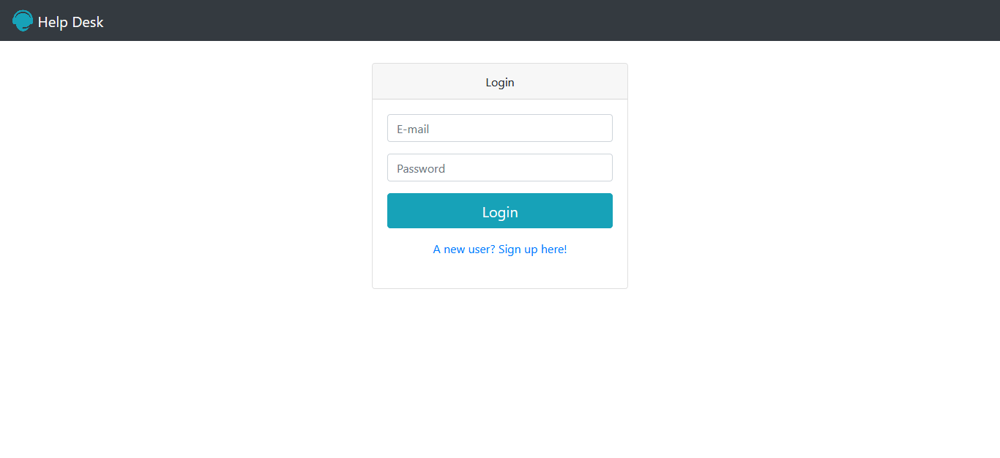
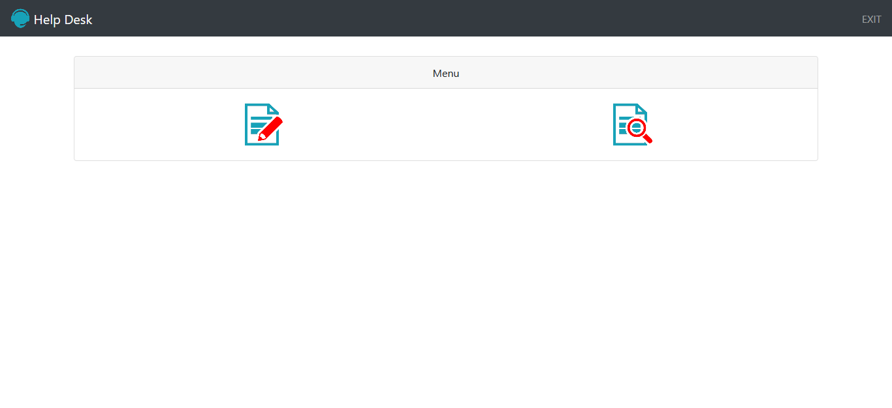
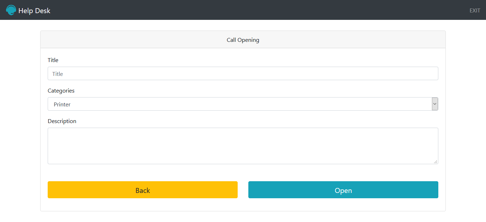
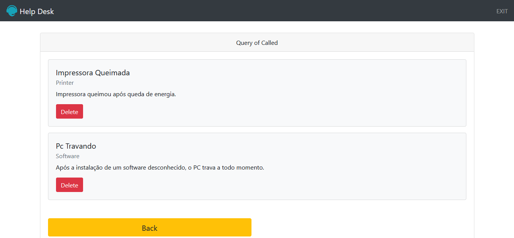

# Help Desk #

Help Desk é um simples sistema de gerenciamento de chamadas para consertos de aparelhos danificados.

<strong>Pode testar aqui:</strong> http://victormarinh.epizy.com/projects/help_desk/index.php

## Techs Utilizadas ##
	- HTML 5
	- CSS 3
	- BootStrap 4
    - PHP 7(POO) + PDO
	- MySQL(phpmyadmin)

## Feito ##

- [X] Login de Usuário Comum.
- [X] Cadastrar novos Usuários.
- [X] Cadastrar novas Chamadas.
- [X] Níveis de acesso para ADM e Usuário Comum.
- [X] Opção de exclusão de chamadas para ADM.

## Como rodar o App ##

	-Primeiro:
		- É preciso importar o arquivo Actions/help_desl.sql no seu Banco de Dados Mysql(De preferência pelo phpmyadmin);
	-Segundo:
		- Configurar o Acesso da aplicação com o Banco de Dados, no arquivo Actions/Connection.php;
	-Terceiro:
		- Ligar servidor do Xampp ou Wampp, acessar o localhost:80 no seu navegador e pronto.

## Telas ##

### Login ###

### Cadastrar novo Usuário ###

### Home ###

### Cadastrar nova Chamada ###

### Ver chamadas ###
